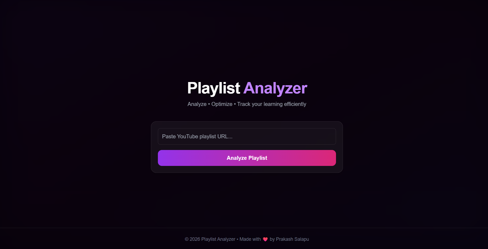
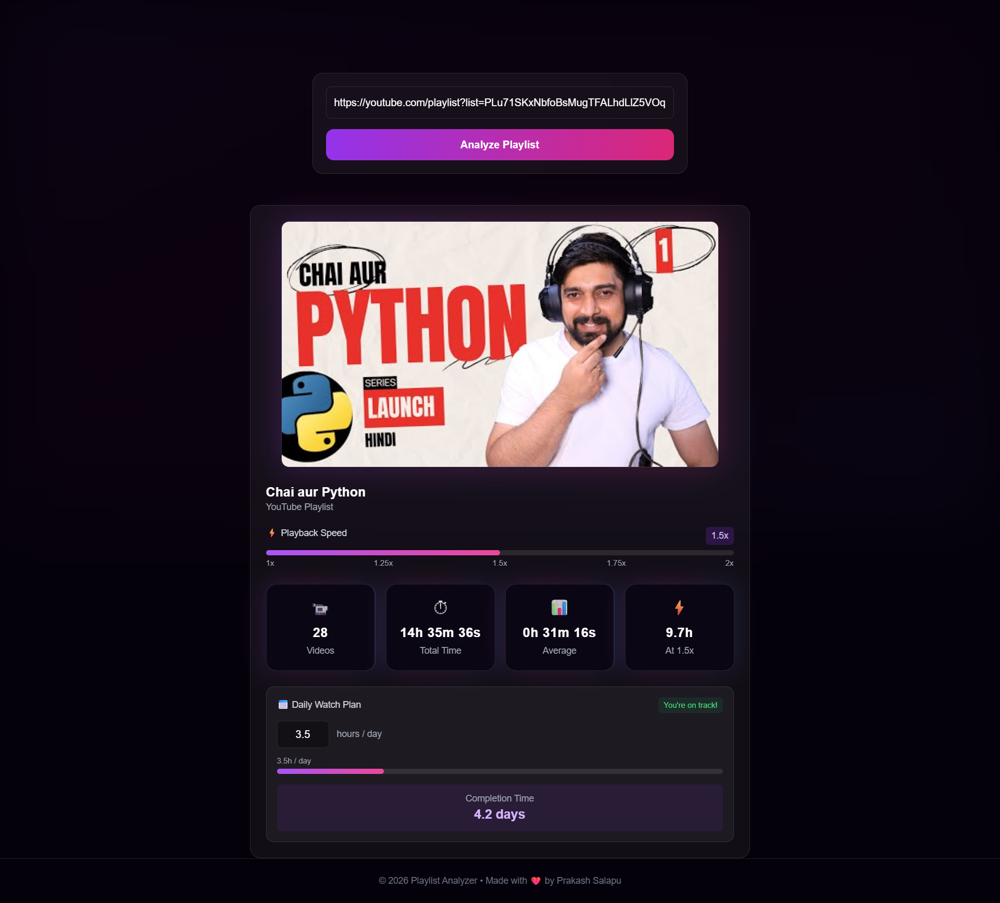

# 🎬 YouTube Playlist Analyzer

A modern web app that analyzes any YouTube playlist and provides insights like total duration, average video length, and optimized watch time based on playback speed.

---

## 🚀 Live Demo

👉 https://yt-playlist-length-calculater.vercel.app

---

## ✨ Features

* 📹 Get total number of videos
* ⏱ Calculate total playlist duration
* 📊 Average video duration
* ⚡ Playback speed optimization (1x → 2x)
* 📅 Daily watch planner (finish in X days)
* 🎯 Inline error handling (no alerts)
* 💎 Premium UI with glassmorphism + gradients
* 📱 Fully responsive (mobile + desktop)

---

## 🧠 Tech Stack

**Frontend**

* React (Vite)
* Tailwind CSS
* Axios

**Backend**

* Node.js
* Express.js
* YouTube Data API v3

**Deployment**

* Frontend: Vercel
* Backend: Render

---

## 📸 Screenshots

### 🏠 Homepage



### 📊 Results UI



---

## ⚙️ Installation & Setup

### 1️⃣ Clone the repo

```bash
git clone https://github.com/your-username/youtube-playlist-analyzer.git
cd youtube-playlist-analyzer
```

---

### 2️⃣ Setup Backend

```bash
cd server
npm install
```

Create `.env` file:

```env
YOUTUBE_API_KEY=your_api_key_here
PORT=5000
```

Run server:

```bash
npm run dev
```

---

### 3️⃣ Setup Frontend

```bash
cd client
npm install
```

Create `.env` file:

```env
VITE_API_URL=http://localhost:5000
```

Run frontend:

```bash
npm run dev
```

---

## 📡 API Endpoint

```http
POST /api/playlist
```

**Request Body**

```json
{
  "url": "https://youtube.com/playlist?list=XXXX"
}
```

**Response**

```json
{
  "title": "Playlist Title",
  "thumbnail": "...",
  "totalVideos": 50,
  "totalDuration": "20h 30m",
  "averageVideoDuration": "24m",
  "playbackTime": {
    "1x": "...",
    "1.5x": "...",
    "2x": "..."
  }
}
```

---

## 🎯 Key Highlights

* Built full-stack app with real API integration
* Designed modern UI inspired by SaaS dashboards
* Focused on **UX (not just UI)**
* Optimized API calls with batching & caching
* Production-ready deployment

---

## 📌 Future Improvements

* 📊 Charts & analytics dashboard
* 🔗 Shareable results link
* 📥 Export data (PDF/CSV)
* 🌐 SEO optimization

---

## 👨‍💻 Author

**Bhanu Prakash Salapu (Prakashh)**

* GitHub: https://github.com/prakashsalapu
* LinkedIn: https://linkedin.com/in/prakashsalapu

---

## ❤️ Acknowledgements

* YouTube Data API
* Open-source community

---

## ⭐ Support

If you like this project, give it a ⭐ on GitHub!

---
